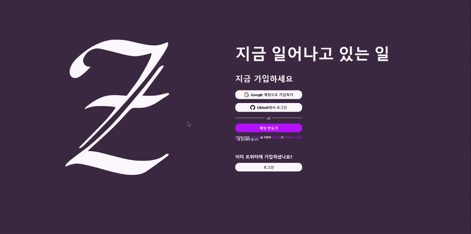
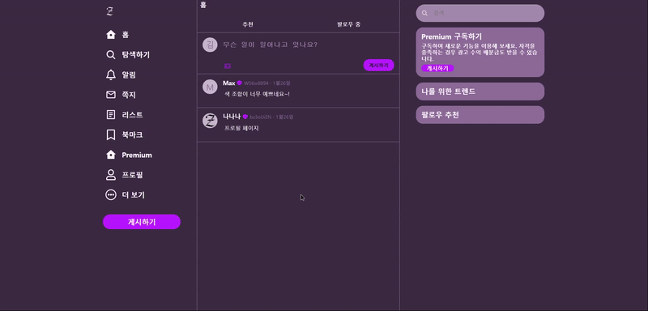
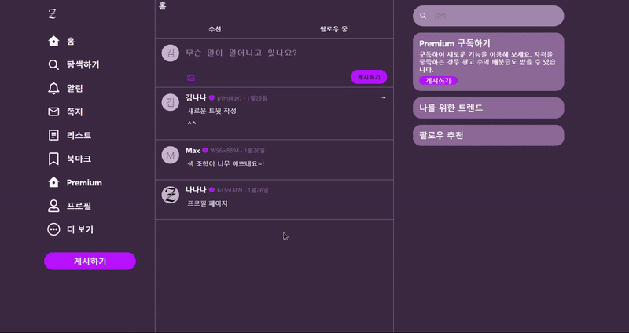
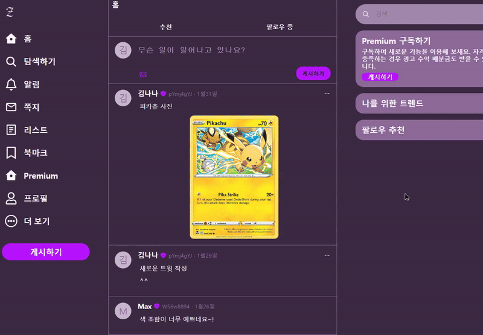
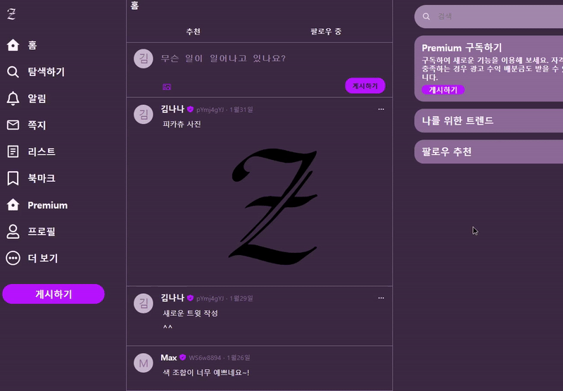
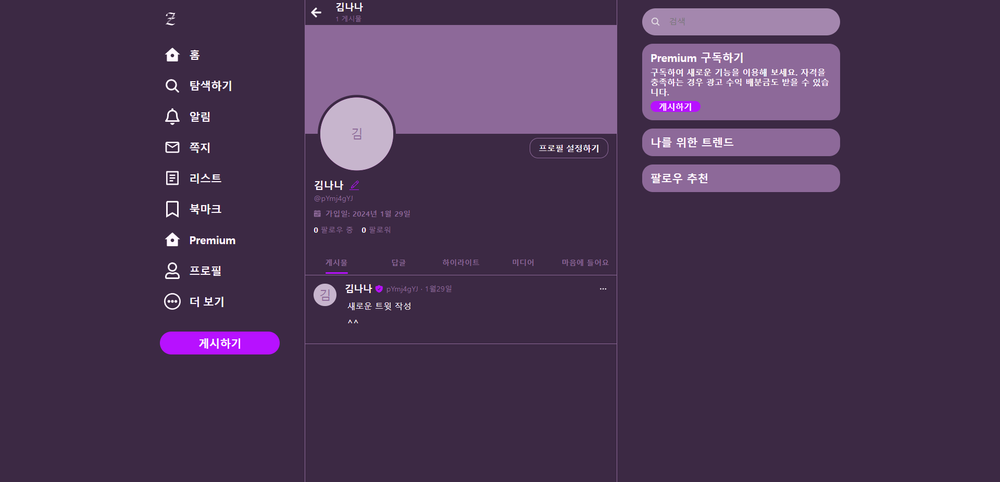
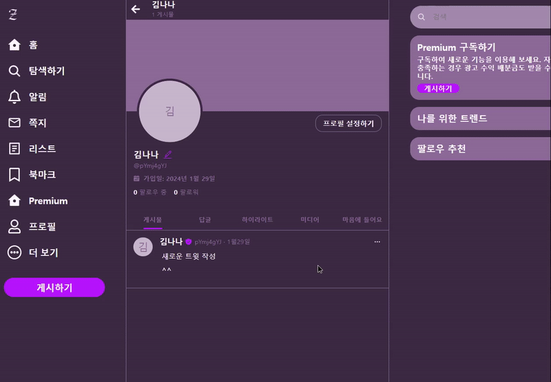
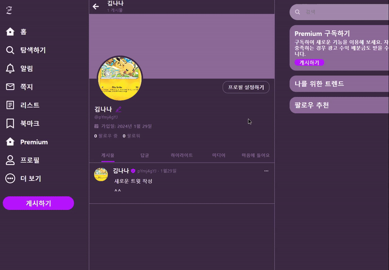
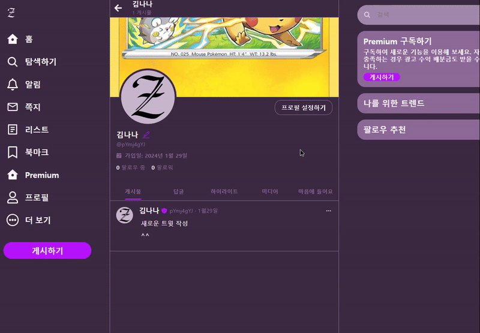

# 트위터 클론 코딩

### nomadcoders에서 강의를 듣고 challenges를 진행 하면서 만들어 봤습니다.

### 사용한 기술 스택:

- ### React
- ### Firebase
- ### styled-components

### 트위터 사이트를 제가 좋아하는 보라색 계열로 만들어 봤습니다.

### 배포된 앱 [URL](nwitter-reloaded-9a028.firebaseapp.com)

## 첫 화면


이메일 로그인, 구글, 깃허브 로그인을 구현하였습니다.

## 계정 생성


닉네임은 3글자 이상 8글자 이하  
이메일은 이메일 형식을  
비밀번호는 특수문자, 대문자, 소문자, 숫자를 포함 8자 이상 20자 이하여야 합니다

## 구글 계정 생성


## 로그인



## 게시글 생성





모달창 형식으로 만들었습니다.  
글자와 이미지 1개를 작성할 수 있습니다.

## 게시글 수정



생성과 동일한 방식으로 만들었습니다.

## 게시글 삭제



## 프로필 페이지



자신의 게시글 수와 작성한 게시글을 볼 수 있습니다.

## 아바타 & 배경화면 변경





## 닉네임 변경



## 만들면서 느낀점

### 처음 시작할때 스타일링을 먼저하고 기능을 추가 하는 방식으로 했는데 스타일링을 하는데 시간이 많이 걸렸습니다. 게다가 styled-components를 작성할때 자동완성이 안되는 경우가 발생했는데 vscode를 최신 버전으로 업데이트를 하여 해결하였습니다.

### 다음에 프로젝트를 할때는 html로 뼈대를 만들고 기능을 먼저 구현한 다음 스타일링을 진행하여 기능을 우선하는 방식으로 만들고 싶습니다. 기능이 없는 부분도 스타일링을 먼저 해버리니 의미없는 구역이 생겨버려 불필요한 시간만 사용한 것 같습니다.

### styled-components를 사용하면서 좋았던 점은 상태값이 변할때 그 값을 바로 css에 적용가능한것이 장점이었습니다. styled-components도 컴포넌트이기 때문에 props로 값을 받아 css스타일에 적용이 가능하기 때문입니다. 그리고 스타일이 재사용 가능하다는 점이 좋았습니다.

### styled-components를 사용하면서 단점으로는 로직파일에 스타일 파일도 같이 들어가는데 스타일을 할때마다 코드의 길이가 너무 길어진다는 점, 스타일을 위해 각 element마다 styled-components방식으로 작성해야 한다는 점이 불편했습니다.

### 파이어베이스에 있는 호스팅, 스토리지, 데이터베이스 3가지 기능을 사용해 봤습니다. 정말 간편하게 백엔드를 구성할 수 있어서 매우 좋았습니다. 구글 계정 하나로 다양한 서비스를 사용할 수 있다는 점도 파이어베이스의 장점입니다.

### 다음은 파이어베이스를 사용할때 꼭 설정해야할 보안규칙입니다.

### 1. 파이어베이스 firestore database & storage 규칙 변경

```
/// firestore
rules_version = '2';

service cloud.firestore {
  match /databases/{database}/documents {

	// /tweets/{doc} 해당 경로에 대한 규칙
    match /tweets/{doc} {
      allow read, create: if request.auth != null // 읽기, 생성은 권한이 있는 요청만 가능함
      allow delete, update: if request.auth.uid == resource.data.userId // 삭제, 업데이트는 요청의 사용자 아이디와 그 요청이 실행될 데이터의 아이디 부분이 같으면 가능
    }
  }
}
```

```
/// storage
rules_version = '2';

service firebase.storage {
  match /b/{bucket}/o {

    match /{allPaths=**} {
      allow read, delete: if request.auth != null
      allow write: if request.auth != null && request.resource.size < 2 * 1024 * 1024 * 8 // 1bit * 8 = 1byte * 1024 = 1kb * 1024 = 1mb
    }
  }
}
```

### 2. API key 보호

[클라우드 구글 콘솔](https://console.cloud.google.com/) 에 들어가서 사용자 인증 정보탭에 Browser key에 애플리케이션 제한 설정을 웹사이트로 하고 배포된 사이트를 추가함
